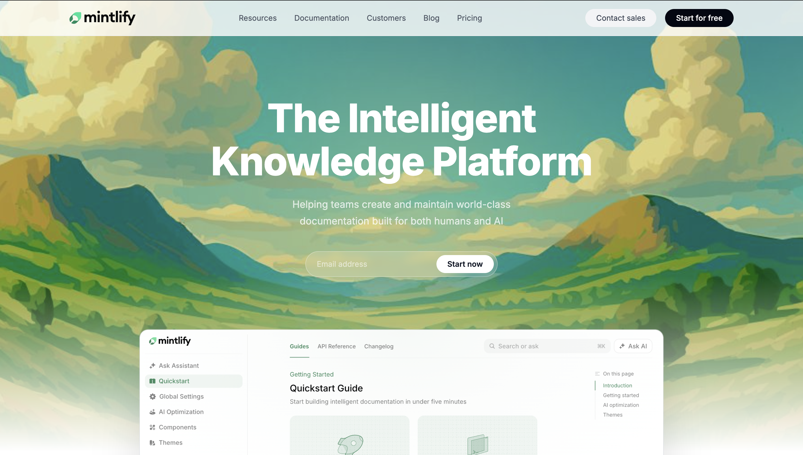

<!-- readme is ai gpt generated -->

# Mentify Clone

This project recreates the main Mintlify-style landing page as a static Vite site using HTML and CSS.

## Recreated Sections

- Fixed top navigation bar with logo, menu links, and CTA buttons
- Hero section with the painted landscape background, headline, supporting text, and email form
- Dashboard preview card layered over the hero area
- Customer logo grid below the hero
- "Built for the intelligence age" feature section with two content cards
- AI assistant showcase section
- Enterprise knowledge section with feature highlights and customer story visual
- Secondary customer logo marquee
- Customer stories/cards section
- Final CTA section with two action buttons and supporting feature cards
- Multi-column footer with social links and status pill

## Fonts Used

- Inter

The font is loaded from Google Fonts in the main HTML file and used as the primary typeface across the full page.

## Colors Used

The UI mostly uses a clean neutral palette with green accents taken from the original reference style.

- White: `#ffffff`
- Primary text: `#111827`
- Secondary text: `#374151`
- Muted text: `#6b7280`
- Soft border/background gray: `#e5e7eb`, `#f3f4f6`, `#f9fafb`
- Dark button/background: `#030712`, `#111827`, `#1f2937`
- Accent green: `#16a34a`
- Status green: `#22c55e`
- Transparent white overlays used in the hero form and navbar for the glass effect

## Screenshot



## Run Locally

```bash
npm install
npm run dev
```